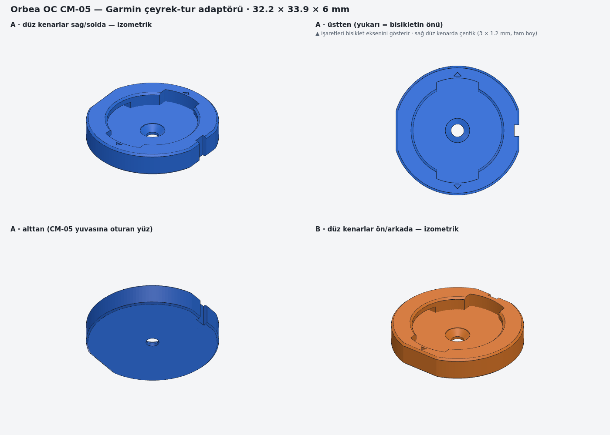

# Orbea OC CM-05 için Garmin çeyrek-tur adaptörü

Orbea'nın **OC CM-05** bilgisayar tutucusu için yazıcıda basılabilen Garmin (ve Sigma) çeyrek-tur adaptörü.
CM-05, **OC MC10 / MC20** boğazlarının üstüne takılır. Bu boğazlar Occam, Rallon, Oiz, Wild ve Rise
modellerinde var.

Referans: Cults3D'deki [“Garmin Orbea support”](https://cults3d.com/en/3d-model/various/support-garmin-orbea)
modeli (yazarı jobulon, 30.01.2024). Bu model sıfırdan, parametrik olarak yeniden çizildi. Dış ölçüler
o modelle aynı: **32.2 × 33.9 × 6 mm**.



## Dosyalar

| Dosya | Ne işe yarar |
|---|---|
| `out/orbea_cm05_garmin_insert_A_duz-kenarlar-sag-solda.stl` | **A** varyantı, doğrudan dilimleyiciye (slicer) atılır |
| `out/orbea_cm05_garmin_insert_B_duz-kenarlar-on-arkada.stl` | **B** varyantı |
| `out/*.step` | Fusion 360, SolidWorks, FreeCAD gibi programlarda düzenlemek için |
| `orbea_cm05_garmin_insert.py` | Parametrik kaynak (CadQuery). Ölçü değiştirip yeniden üretmek için |
| `preview.png` | Önizleme |

## Hangi varyantı basmalıyım?

Tutucunun düz kenarları (32.2 mm) CM-05 yuvasının düz kenarlarına oturur. Garmin'in düz durması için bu
kenarların doğru yöne bakması gerekiyor:

- Yuvanın düz kenarları **sağa ve sola** bakıyorsa **A**'yı bas.
- Yuvanın düz kenarları **öne ve arkaya** bakıyorsa **B**'yi bas.

Adaptörün üstündeki iki küçük **▲ işareti** bisikletin ön-arka eksenini gösterir. Takınca işaretler
ön tekere doğru bakmalı. Yan tarafa bakıyorlarsa diğer varyantı bas. Emin değilsen ikisini de bas,
her biri yaklaşık 4–5 g ve 20 dakikalık bir baskı.

## Kenar çentiği

Orijinal parçanın kenarında olduğu gibi bu modelde de bir çentik var. Düz kenarlardan birinin
ortasında, dikdörtgen biçiminde ve parçanın alttan üste tüm yüksekliği boyunca uzanıyor:
**3 mm genişlik × 1.2 mm derinlik**. A'da sağ düz kenarda, B'de ön düz kenardadır. B'de o taraftaki
▲ işareti kaldırıldı, çünkü çentik zaten ön tarafı gösteriyor.

Çentiğin konumu, şekli ve ölçüsü orijinal dosya incelenemediği için tahmin. Düz kenarın seçilmesinin
nedeni şu: Cults3D parçanın ölçüsünü 33.9 mm bildiriyor. Çentik yuvarlak kenarın tam ortasında
olsaydı bu ölçü 33.8 mm'ye düşerdi. Düz kenardaki bir çentik ise iki ölçüyü de değiştirmez.
Orijinalinden farklıysa aşağıdaki çentik parametrelerini değiştir.

## Montaj

1. Adaptörü CM-05 yuvasına oturt.
2. Ortadaki deliğe **M3 havşa başlı vida** (DIN 7991 / ISO 10642) tak. CM-05'in kendi vidasını kullan.
   Vida başı zeminin 0.2 mm altında kalır, cihaza değmez.
3. Garmin'i yan çevrilmiş halde (ekranın üstü sola bakarken) yerleştir ve **saat yönünde 90°**
   çevir. Sona yakın küçük bir “klik” hissedeceksin. Durdurucular fazla dönmeyi ve ters yönü engeller.

## Baskı ayarları

| Ayar | Öneri |
|---|---|
| Malzeme | **PETG** ya da **ASA**. PLA güneşte, kapalı arabada yumuşayabilir |
| Yön | Alt yüz (düz, delikli taraf) tabla üzerinde. Dosyalar zaten bu yönde |
| Katman | 0.12–0.16 mm (dudaklar 1.8 mm kalınlığında, ince katman daha iyi sonuç verir) |
| Duvar / dolgu | 4–5 duvar ya da %100 dolgu |
| Destek | **Kapalı.** Dudak altı çıkıntı yalnızca 2.1 mm. 1.8 mm'lik boşluğa giren destek temizlenemez |
| Nozul | 0.4 mm |

## İlk denemede tam oturmazsa: ayar tablosu

Garmin çeyrek-tur ölçülerini yayımlamıyor. Bu dosyadaki Garmin ölçüleri, yaygın ölçümlere dayanan
tahminler. Yazıcıdan yazıcıya da ±0.1–0.2 mm fark çıkabilir. Gerekirse şu parametreleri değiştir:

| Belirti | Parametre | Varsayılan | Yön |
|---|---|---|---|
| Adaptör CM-05 yuvasına girmiyor | `outline_offset` | 0.0 | −0.1 / −0.2 |
| Garmin yuvaya hiç girmiyor | `lip_inner_d`, `window_w` | 23.4 / 11.0 | büyüt (24.0 / 12.0) |
| Giriyor ama dönmüyor ya da çok sıkı | `slot_gap`, `slot_d`, `detent_h` | 1.8 / 27.6 / 0.35 | 2.0 / 28.2 / 0.2 |
| Kilitleniyor ama boşluklu, tıkırdıyor | `slot_gap`, `detent_h` | 1.8 / 0.35 | 1.65 / 0.45 |
| Tam düz konuma gelmeden duruyor | `tab_w` | 9.0 | büyüt (9.6) |
| Kilitliyken yukarı çekince çıkıyor | `lip_inner_d` | 23.4 | küçült (22.8) |
| CM-05'in vidası M3 değil | `screw_hole_d`, `csk_d` | 3.4 / 6.4 | M4 için 4.4 / 8.4 |
| Çentik yuvarlak kenarda olmalı | `notch_on` | flat | `round` (çentiksiz için `none`) |
| Çentik iki tane, karşılıklı olmalı | `notch_count` | 1 | 2 |
| Çentiğin şekli farklı | `notch_shape` | rect | `u` (yuvarlak dipli) ya da `v` (üçgen) |
| Çentiğin ölçüsü farklı | `notch_w`, `notch_depth` | 3.0 / 1.2 | ölçtüğün değer (düz kenarda derinlik en fazla ~1.5) |
| Çentik yalnızca altta olmalı | `notch_height` | 0 (tam boy) | alttan yüksekliği, ör. 2.0 |

Yeniden üretmek için:

```bash
pip install cadquery
python orbea_cm05_garmin_insert.py --set slot_gap=1.7 detent_h=0.45
python orbea_cm05_garmin_insert.py --set notch_on=round notch_w=4 notch_depth=1.5
```

Komut her iki varyantı da `out/` klasörüne STL ve STEP olarak yeniden yazar.

## Bilinmesi gerekenler

- **Kaynak ölçüler:** Dış ölçüler (32.2 × 33.9 × 6 mm) ve adaptörün CM-05'e tek vidayla bağlandığı
  bilgisi Cults3D sayfasından ve Orbea'nın CM-05 / CT-02 ürün açıklamalarından alındı.
  Orijinal STL dosyası ve CM-05 yuvasının teknik çizimi incelenemedi.
- **Tahmin edilenler:** Vida yeri ve çapı (ortada, M3 havşa), düz kenarların sayısı (iki simetrik düz
  kenar), kenar çentiğinin yeri ve ölçüsü, Garmin dişi geometrisi. Hepsi parametre olarak ayarlanabilir.
- **Doğrulanan:** Model, tahmini ölçülerle oluşturulmuş sanal bir Garmin erkek parçasıyla test edildi.
  Bu test geometrinin kendi içinde tutarlı olduğunu gösteriyor, gerçek cihazla uyumu kanıtlamıyor.
  Sanal parça yukarıdan çakışmadan giriyor, saat yönünde serbestçe dönüyor ve son birkaç derecede klik
  çıkıntısının üstünden geçiyor. Kilit konumunda boşta duruyor. Ters yöne ve kilit noktasının ötesine
  dönmesini durdurucular engelliyor. Kilitliyken yukarı çekilince dudaklara takılıyor. Mesh su
  geçirmez (watertight) ve tek parça.
- Elinde orijinal Wahoo ya da Bryton adaptörü varsa, dış hatlarını ve vida yerini kumpasla
  karşılaştırmak ilk baskıdan önce en hızlı kontrol olur.
